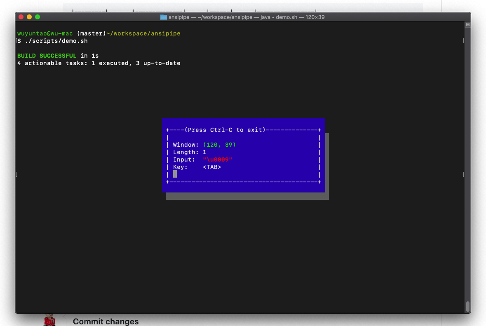

ANSI Pipe
==========

A tiny project to power kotlin projects with *nix console control 

Purpose
=======
The purpose of this project is to enable kotlin console programs to:
* Detect single key press, e.g: <Tab>key, direction keys
* Output colorful texts
* Control the position of console print.

The old solutions are:
1. To include a native library (JNI) in java library, to control console input.
1. To call native programs
1. To create your own console GUI

The problems of those solutions are:
1. Very complicated
1. Have compatibility problems

Solution
========
This solution includes 2 parts:
1. A shell script, responsible to read raw key press.
1. A Kotlin program, implementing the main feature.

These 2 parts are connected by a pipe

```
+---------+       +--------------+      +------+      +-----------------+
|         | ----> |    Script    | ---> | Pipe | ---> |(stdin)          |
|         |       |(read raw key)|      |      |      |                 |
| Console |       +--------------+      +------+      | Kotlin Program  |
|         |                                           |                 |
|         | <---------------------------------------- |(stdout)         |
+---------+                                           +-----------------+
```

1. The loops to read one key press
1. When user press anything, the script will send the key to pipe
1. The Kotlin program reads the pipe
1. Then the Kotlin program print output to console, with ANSI code.

Precondition
============
1. This library only support __*nix__ shell environment (Linux, Mac OS X, Cygwin, MinGW, etc.). Windows __cmd__ is not supported. 
1. Currently, only __bash__ and __zsh__ are supported. Other shells are not tested.

Demo
=====
In project root, type following:

```
./script/demo.sh

```

Screenshot:


How to use
==========
In build.gradle:

```
sourceControl {
    gitRepository("git@github.com:WuYuntaoTheGreat/ansipipe.git") {
        producesModule("cn.wuyatang.ansipipe:ansipipe")
    }
}

dependencies {
    ...

    implementation 'cn.wuyatang.ansipipe:ansipipe:v0.1.1'
}

```

